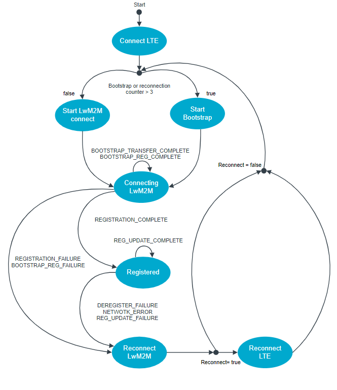

.. _LWM2M introduction:

LWM2M introduction
###################

LwM2M is an application layer protocol based on CoAP over UDP. It is designed to expose various resources for reading, writing, 
and executing through an LwM2M server in a very lightweight environment. The client sends data such as sensor data, 
GNSS position to the LwM2M server. It can also receive activation commands such as mator on off,reset device...

LwM2M client state diagram
***************************

The following diagram shows states and transitions for the LwM2M Client:

When the device boots up, the sample first connects to the LTE network and initiates the LwM2M connection. 
If there are errors, in most error cases, the sample tries to reconnect the LwM2M client. In the case of network errors, 
it tries to reconnect the LTE network. When the number of retries to restore the network connection exceeds three times, 
the sample falls back to the bootstrap. This enables the recovery in the cases where the LwM2M client credentials are outdated or removed from the server.

LWM2M water meter introduction
******************************

The LwM2M water meter demonstrates usage of the `Lightweight Machine to
Machine
(LwM2M) <https://developer.nordicsemi.com/nRF_Connect_SDK/doc/latest/nrf/documentation/glossary.html#term-Lightweight-Machine-to-Machine-LwM2M>`__
protocol to connect a water meter to AVsystem through LTE/NBIOT. This
sample uses the `LwM2M client
utils <https://developer.nordicsemi.com/nRF_Connect_SDK/doc/latest/nrf/libraries/networking/lwm2m_client_utils.html#lib-lwm2m-client-utils>`__
library.

The sample also supports a proprietary mechanism to fetch location
assistance data from `nRF
Cloud <https://nrfcloud.com/?__hstc=8439722.cbeac76abe662bf67fe62ab3247a2a9b.1663037262283.1688002378986.1688026636411.129&__hssc=8439722.4.1688026636411&__hsfp=4099787016>`__
by proxying it through the LwM2M server. For this, the sample makes use
of the `LwM2M location
assistance <https://developer.nordicsemi.com/nRF_Connect_SDK/doc/latest/nrf/libraries/networking/lwm2m_location_assistance.html#lib-lwm2m-location-assistance>`__
library.