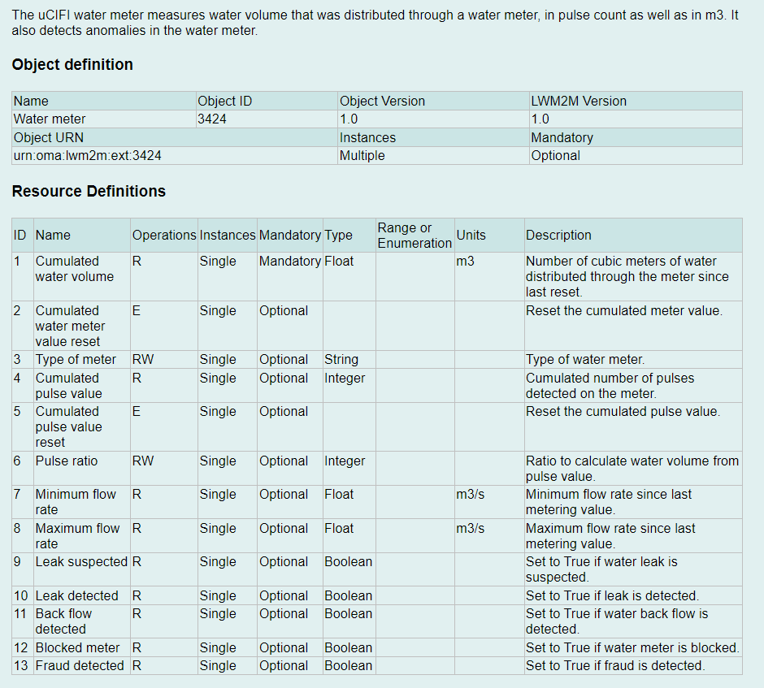

.. _samples:

Samples
#######

overview
********

The sample implements the following LwM2M objects:

=================================== ========= ==========
LwM2M objects                       Object ID nRF9160 DK
=================================== ========= ==========
LwM2M Server                        1         Yes
Device                              3         Yes
Connectivity Monitoring             4         Yes
Water meter                         3424      Yes
ECID-Signal Measurement Information 10256     Yes
GNSS Assistance                     33625     Optional
Ground Fix                          33626     Yes
Advanced Firmware Update            33629     Yes
=================================== ========= ==========

water meter objects has below resources:

Notifications
*************

LwM2M specifies the Notify operation, which can be used to notify the
server of changes to the value of a resource field, for example, the
measured value of a water meter sensor. This allows active monitoring
while using minimal bandwidth, as notifications can be sent with the
updated values without the need for the server querying the client
regularly.

To enable notifications, the server must initiate an observation request
on one or more resources of interest. For more information, see
**Enabling notifications** chapter below.

.. _lwm2msend:

LWM2M_send
**********

LwM2M also supports active data reporting, which can be used to send the
alarm message to cloud timely, for example, if the water leakage alarm
is detected, the device will immediately be awakened and connected to
the LWM2M server, reporting the alarm message to the cloud timely.

`Release Assistance Indication (RAI)`_.
*****************************************

If you have low-level control over the protocol your IOT device uses,
you might know when you should not expect more data. In that case, you
can request to skip the RRC idle mode using `Release Assistance
Indication
(RAI)`_.
The recommended way to do this is enable below macro:

**CONFIG_LWM2M_CLIENT_UTILS_RAI=y**

.. _Sample building and running:

Sample building and running
***************************

#. | Pull the source code 
   
       .. code-block:: console

         $ git clone https://github.com/Noy0908/lwm2m-water-meter/tree/water-meter_v2.4.99

#. | checkout branch.

       .. code-block:: console

          $ git checkout water-meter_v2.4.99

   .. note::
      The branch **water-meter_v2.4.99** is the application code which runs on nRF9160DK.

      The branch **pwm-pulse-count** is used to generate pulse waveforms which runs on nRF52840DK to simulate water flow sensor.

#. | Set the LWM2M PSK

   * | Open ``src/prj.conf``, set `CONFIG_APP_LWM2M_PSK <https://developer.nordicsemi.com/nRF_Connect_SDK/doc/latest/nrf/samples/nrf9160/lwm2m_client/sample_description.html#config-app-lwm2m-psk>`__
       to the hexadecimal representation of the PSK you will use when registering the device with the server.

#. | Build the sample with the following overlays:

  - ``overlay-avsystems.conf``

  - ``overlay-lwm2m-1.1.conf``

  - ``overlay-assist-cell.conf``

  - ``overlay-adv-firmware.conf``

  - ``overlay-lowpower.conf``

  - ``overlay-dtls-cid.conf``

  - ``boards/nrf9160dk_nrf9160_ns.conf``
  
  **if you want to use NBIOT network, you need to add below config file.**

  - ``overlay-nbiot.conf``

.. _Release Assistance Indication (RAI): https://developer.nordicsemi.com/nRF_Connect_SDK/doc/latest/nrf/documentation/glossary.html#term-Release-Assistance-Indication-RAI